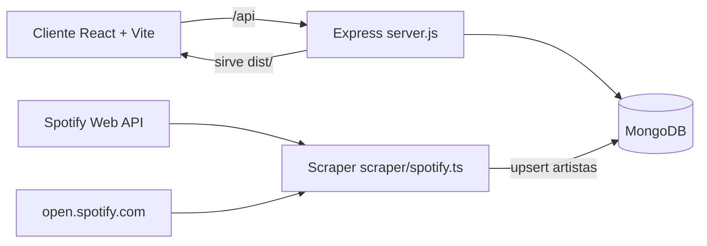

# Higher or Lower — Spotify Argentina

Juego de adivinanza basado en oyentes mensuales reales de artistas en Spotify Argentina.
El usuario debe adivinar si un artista tiene más o menos oyentes que otro.

[](https://render.com)
[](https://react.dev)
[](https://www.typescriptlang.org)
[](https://nodejs.org)
[](https://mongodb.com)
[](./LICENSE)

---

## Tabla de contenidos

1. [Resumen del proyecto](#resumen-del-proyecto)
2. [Stack tecnológico](#stack-tecnológico)
3. [Arquitectura general](#arquitectura-general)
4. [Estructura de carpetas](#estructura-de-carpetas)
5. [Inicio rápido](#inicio-rápido)
6. [Variables de entorno](#variables-de-entorno)
7. [Scripts disponibles](#scripts-disponibles)
8. [Backend en detalle](#backend-en-detalle)
9. [Frontend en detalle](#frontend-en-detalle)
10. [Scraper en detalle](#scraper-en-detalle)
11. [Deploy y jobs programados](#deploy-y-jobs-programados)
12. [Modelo de datos](#modelo-de-datos)
13. [Flujo completo de juego](#flujo-completo-de-juego)
14. [Troubleshooting](#troubleshooting)
15. [Limitaciones y mejoras sugeridas](#limitaciones-y-mejoras-sugeridas)
16. [Contribuir](#contribuir)
17. [Licencia](#licencia)

---

## Resumen del proyecto

Este repositorio implementa:

- Una experiencia de juego donde el usuario adivina si un artista tiene más o menos oyentes mensuales que otro.
- Un leaderboard persistente en MongoDB.
- Recomendación de artistas para usuarios del top 10.
- Un scraper que mantiene la base de artistas actualizada con datos reales de Spotify.

**Objetivo:** mantener una base de artistas argentinos y permitir partidas rápidas con persistencia de ranking.

### Estado del proyecto

| Componente | Ubicación |
|---|---|
| Frontend | `src/` |
| Backend API + static server | `server.js` |
| Scraper | `scraper/spotify.ts` |
| Configuración de deploy | `render.yaml` |
| Workflow de scraping | `.github/workflows/update.yml` |

---

## Stack tecnológico

### Frontend

- React 18 + TypeScript
- Vite — bundler y dev server
- Tailwind CSS — estilos
- Framer Motion — animación del contador de listeners

### Backend

- Node.js + Express
- Mongoose + MongoDB
- `express-rate-limit`, `compression`, `cors`, `dotenv`

### Scraping / ingestión de datos

- Spotify Web API (`spotify-web-api-node`)
- Puppeteer — scraping de oyentes mensuales desde páginas públicas
- `vite-node` — ejecución de TypeScript sin compilación previa

---

## Arquitectura general



**Responsabilidades:**

- `src/` — UX del juego, estado de partida, peticiones HTTP.
- `server.js` — API REST, reglas de negocio, leaderboard, recomendaciones y static hosting.
- `scraper/spotify.ts` — actualización periódica de artistas en la base de datos.

---

## Estructura de carpetas

```text
higher-or-lower-spotify/
├── .github/
│   └── workflows/
│       └── update.yml          # Job programado de scraping (cada 5 días)
├── public/
│   └── lost-background.jpg
├── scraper/
│   ├── artists.ts              # Lista de URLs de artistas Spotify
│   └── spotify.ts              # Script de scraping y upsert a MongoDB
├── src/
│   ├── components/
│   │   ├── CurrentScore.tsx
│   │   ├── HighScore.tsx
│   │   ├── Leaderboard.tsx
│   │   ├── LeftArtist.tsx
│   │   ├── Listeners.tsx
│   │   └── RightArtist.tsx
│   ├── hooks/
│   │   ├── useInitialArtists.tsx
│   │   ├── useLeaderboardCache.tsx
│   │   └── useUserId.tsx
│   ├── pages/
│   │   ├── Home.tsx
│   │   ├── Game.tsx
│   │   └── Lost.tsx
│   ├── utils/
│   │   ├── Artist.tsx
│   │   ├── Types.ts
│   │   └── Types.tsx
│   ├── App.tsx
│   ├── main.tsx
│   └── index.css
├── render.yaml                 # Servicio web + cron en Render
├── server.js                   # Backend API
├── vite.config.ts
└── package.json
```

---

## Inicio rápido

### Requisitos previos

- Node.js 20 o superior
- npm
- MongoDB local o [MongoDB Atlas](https://www.mongodb.com/atlas)

### 1. Clonar e instalar dependencias

```bash
git clone https://github.com/ChickenCombo/higher-or-lower-spotify.git
cd higher-or-lower-spotify
npm install
```

### 2. Configurar variables de entorno

Crear un archivo `.env` en la raíz del proyecto:

```env
PORT=5000
MONGODB_URI=mongodb://localhost:27017/spotify_artists
SPOTIFY_CLIENT_ID=tu_spotify_client_id
SPOTIFY_CLIENT_SECRET=tu_spotify_client_secret
```

Ver la sección [Variables de entorno](#variables-de-entorno) para una descripción completa.

### 3. Popular la base de datos (primera vez)

```bash
npm run scrape
```

### 4. Levantar el proyecto

```bash
# Terminal 1 — backend
npm run start

# Terminal 2 — frontend
npm run dev
```

| Servicio | URL |
|---|---|
| Frontend (Vite) | http://localhost:5173 |
| Backend API | http://localhost:5000 |

Vite usa proxy para `/api` hacia `http://localhost:5000` (ver `vite.config.ts`).

---

## Variables de entorno

| Variable | Usado en | Obligatoria | Descripción |
|---|---|---|---|
| `PORT` | `server.js` | No | Puerto del backend (default: 5000) |
| `MONGODB_URI` | backend + scraper | Sí | URI de conexión a MongoDB |
| `VITE_MONGODB_URI` | backend + scraper | No | Fallback de URI de Mongo |
| `SPOTIFY_CLIENT_ID` | scraper | Sí (para scraping) | Credencial Spotify API |
| `SPOTIFY_CLIENT_SECRET` | scraper | Sí (para scraping) | Credencial Spotify API |
| `NODE_ENV` | deploy | No | Ajustes de entorno en Render |

---

## Scripts disponibles

| Script | Comando | Descripción |
|---|---|---|
| `npm run dev` | `vite` | Frontend en modo desarrollo |
| `npm run build` | `tsc && vite build` | Genera `dist/` del frontend |
| `npm run start` | `node server.js` | Backend + sirve `dist/` en producción |
| `npm run preview` | `vite preview` | Preview estático del build |
| `npm run scrape` | `cd scraper && npx vite-node spotify.ts` | Scraping y upsert de artistas |
| `npm run lint` | `eslint . ...` | Corre el linter |
| `npm run format` | `prettier --write .` | Formatea el código |

---

## Backend en detalle

Archivo principal: `server.js`

### Middlewares

| Middleware | Propósito |
|---|---|
| `compression()` | Comprime respuestas HTTP para reducir payload |
| `cors()` | CORS abierto para el frontend |
| `express.json({ limit: "10kb" })` | Parseo JSON con límite de 10 KB |
| Rate limit en `/api/*` | 1000 requests / 5 min / IP |

### Conexión a MongoDB

Usa `mongoose.connect()` con los siguientes parámetros:

- `maxPoolSize: 10`
- `serverSelectionTimeoutMS: 5000`
- `socketTimeoutMS: 45000`

Fallback de URI: `MONGODB_URI` → `VITE_MONGODB_URI` → `mongodb://localhost:27017/spotify_artists`

### Cache en memoria

El leaderboard se cachea en memoria del proceso con un TTL de 60 segundos (`CACHE_TTL = 60000`).
El cache se invalida automáticamente en `POST /api/leaderboard`.

### Endpoints API

#### `POST /api/artists/random`

Devuelve un artista aleatorio evitando los IDs recibidos en `excludeIds`.

```json
// Request
{
  "excludeIds": ["spotifyId1", "spotifyId2"],
  "includeListeners": true
}

// Response
{
  "artist": "Duki",
  "image_url": "https://...",
  "spotifyId": "1bAftSH8umNcGZ0uyV7LMg",
  "listeners": "12345678"
}
```

Si `includeListeners` es `false`, el campo `listeners` no se incluye en el payload para no revelar la respuesta. Si no quedan artistas disponibles fuera de `excludeIds`, resetea la lista y responde con `reset: true`.

---

#### `POST /api/artists/listeners`

Devuelve los oyentes numéricos de un artista por `spotifyId`.

```json
// Request
{ "spotifyId": "1bAftSH8umNcGZ0uyV7LMg" }

// Response
{ "listeners": 12345678 }
```

Códigos de error: `400` (spotifyId faltante o inválido), `404` (artista no encontrado), `500` (error de parseo o DB).

---

#### `GET /api/leaderboard`

Devuelve el top 10. Acepta el query param `userId` para incluir la posición del usuario.

```json
{
  "leaderboard": [
    { "userId": "abc", "username": "Theo", "score": 15 }
  ],
  "userInfo": {
    "position": 18,
    "totalPlayers": 320,
    "score": 7,
    "username": "Theo",
    "isInTop10": false,
    "canRecommend": false
  }
}
```

---

#### `POST /api/leaderboard`

Crea o actualiza el score de un usuario. Solo actualiza si el nuevo score supera al registrado.
Invalida el cache del servidor y devuelve el leaderboard actualizado junto con `userInfo`.

```json
{ "userId": "abc123", "username": "Theo", "score": 10 }
```

---

#### `POST /api/recommendations`

Permite recomendar un artista si el usuario está en el top 10 y no ha recomendado anteriormente.
Solo se permite una recomendación por `userId`.

```json
// Request
{
  "userId": "abc123",
  "username": "Theo",
  "artistName": "Nombre del artista"
}

// Response
{
  "message": "Recomendacion guardada exitosamente",
  "recommendation": {
    "artistName": "Nombre del artista",
    "status": "pending",
    "recommendedAt": "2026-03-24T12:00:00.000Z"
  }
}
```

### Static hosting

En producción, `server.js` sirve el frontend compilado desde `dist/` y actúa como catch-all para React Router.

---

## Frontend en detalle

### Estado global (`GameContext`)

`src/App.tsx` define el estado compartido del juego:

- `hasGameStarted`, `hasUserLost`, `score`, `pendingBestScore`
- `isButtonVisible`
- `InitialLeftArtist`, `InitialRightArtist`
- `userId` — persistido en localStorage por el hook `useUserId`

### Páginas

#### `Home.tsx`

Inicializa los artistas en `useEffect`. Al hacer click en "Empezar", navega a la vista `Game`.

#### `Game.tsx`

Carga artistas del contexto. Al responder "Más" o "Menos":

1. Solicita los listeners reales del artista derecho (`POST /api/artists/listeners`).
2. Revela los listeners y bloquea los botones temporalmente.
3. Evalúa si la respuesta es correcta.
4. Si acierta: incrementa el puntaje, rota artistas y trae uno nuevo.
5. Si falla: navega a la pantalla de derrota.

Mantiene el high score en `localStorage` bajo la clave `spotify-high-score`.

#### `Lost.tsx`

Muestra el puntaje final, renderiza el componente `Leaderboard` y permite reiniciar la partida.

### Hooks

#### `useInitialArtists`

Obtiene dos artistas para iniciar la ronda. Guarda los IDs usados en `localStorage` (`usedArtistIds`) para evitar repeticiones. Resetea la lista local cuando supera 200 IDs.

#### `useLeaderboardCache`

Cache cliente en `localStorage` con TTL de 5 minutos. Si el cache expiró, vuelve a consultar la API.

#### `useUserId`

Si no existe `user-id` en localStorage, genera uno nuevo (`timestamp + random`). Este ID representa al jugador en el leaderboard.

### Componente `Leaderboard.tsx`

- Muestra el top 10 cacheado.
- Detecta un nuevo high score (`pendingBestScore`) y solicita un username.
- Envía el score al backend y muestra la posición del usuario.
- Habilita el formulario de recomendación cuando el usuario entra al top 10 y aún no recomendó.

---

## Scraper en detalle

Archivo: `scraper/spotify.ts`

### Flujo de ejecución

1. Conecta a MongoDB.
2. Obtiene token de Spotify usando Client Credentials.
3. Recorre las URLs de artistas definidas en `scraper/artists.ts`.
4. Por cada artista:
   - Extrae metadata por Spotify API (`name`, `image`, `id`).
   - Scrapea oyentes mensuales desde la página pública con Puppeteer.
   - Realiza upsert en MongoDB por `spotifyId`.
5. Cierra el browser y la conexión a la base de datos.

### Detalles técnicos

- Navegación con `page.goto(..., { waitUntil: "networkidle2" })` más una espera adicional de 3 segundos para estabilizar el render.
- Regex que detecta texto del tipo `"X oyentes mensuales"`, limpia caracteres y convierte a entero.

### Ejecución manual

```bash
npm run scrape
```

Requiere las variables: `MONGODB_URI`, `SPOTIFY_CLIENT_ID`, `SPOTIFY_CLIENT_SECRET`.

---

## Deploy y jobs programados

### Render (`render.yaml`)

| Servicio | Build | Start | Schedule |
|---|---|---|---|
| `web` | `npm install && npm run build` | `node server.js` | — |
| `update-artists-db` (cron) | — | `cd scraper && npx vite-node spotify.ts` | `0 0 * * *` (diario, medianoche UTC) |

### GitHub Actions (`.github/workflows/update.yml`)

- Cron: `0 0 */5 * *` (cada 5 días, UTC).
- También admite disparo manual (`workflow_dispatch`).

**Nota:** si se usan el cron de Render y el workflow de GitHub Actions simultáneamente, el scraper se ejecutará desde dos fuentes en paralelo. Se recomienda elegir una única estrategia para evitar ejecuciones duplicadas.

---

## Modelo de datos

### Colección `artists`

| Campo | Tipo | Notas |
|---|---|---|
| `spotifyId` | string (unique) | Identificador de Spotify |
| `artist` | string | Nombre del artista |
| `listeners` | string* | Ver nota de inconsistencia de tipos |
| `image_url` | string | URL de la imagen de perfil |
| `updatedAt` | date | Fecha de la última actualización |

> El scraper guarda `listeners` como `number`, pero el schema del servidor lo declara como `string`. Mongoose suele castear automáticamente, pero se recomienda unificar el tipo en todo el stack para evitar inconsistencias.

### Colección `leaderboards`

| Campo | Tipo | Índice |
|---|---|---|
| `userId` | string | unique |
| `username` | string | — |
| `score` | number | desc |

### Colección `artistrecommendations`

| Campo | Tipo | Notas |
|---|---|---|
| `userId` | string | unique |
| `username` | string | — |
| `artistName` | string | — |
| `recommendedAt` | date | — |
| `status` | `pending \| approved \| rejected` | Estado inicial: `pending` |

---

## Flujo completo de juego

```
1. Usuario accede a Home
2. Frontend solicita 2 artistas aleatorios al backend
3. Se inicia la partida: artista izquierdo (listeners visibles) + derecho (listeners ocultos)
4. Usuario responde más / menos
5. Frontend solicita los listeners reales del artista derecho
6. Evaluación:
   ├── Correcto   → score +1, rota artistas, solicita nuevo artista derecho
   └── Incorrecto → pantalla de derrota
7. Si hay nuevo high score:
   └── Solicita username → envía score al backend
8. Backend actualiza leaderboard y devuelve top 10 + posición del usuario
9. Si el usuario está en top 10 y no recomendó → habilita formulario de recomendación
```

---

## Troubleshooting

### El juego no carga artistas

- Verificar que el backend corre en `:5000` y el frontend en `:5173`.
- Confirmar que MongoDB es accesible y tiene datos en la colección `artists`.
- Si la base de datos está vacía, ejecutar `npm run scrape`.

### Error 429 en la API

Se superó el rate limit (1000 requests / 5 min / IP). Esperar 5 minutos o ajustar los parámetros de `express-rate-limit` en `server.js`.

### El scraper no encuentra oyentes mensuales

Posibles causas: cambios en el HTML de Spotify, bloqueo anti-bot o timeout de red.

Sugerencias:
- Aumentar los timeouts y tiempos de espera.
- Revisar el selector CSS o la expresión regular.
- Probar con un subconjunto reducido de artistas.

### El leaderboard no refleja cambios al instante

Existe cache en el backend (60 s) y en el frontend (5 min). Durante el debug, forzar un refresh manual o limpiar las claves de leaderboard en localStorage.

---

## Contribuir

Las contribuciones son bienvenidas. Para cambios de cierta envergadura, se recomienda abrir un issue primero para discutir el enfoque.

1. Hacer un fork del repositorio.
2. Crear un branch: `git checkout -b feature/nueva-funcionalidad`.
3. Commitear los cambios: `git commit -m 'feat: descripción del cambio'`.
4. Pushear el branch: `git push origin feature/nueva-funcionalidad`.
5. Abrir un Pull Request.

---

## Licencia

Este proyecto está bajo la [Licencia MIT](./LICENSE).
